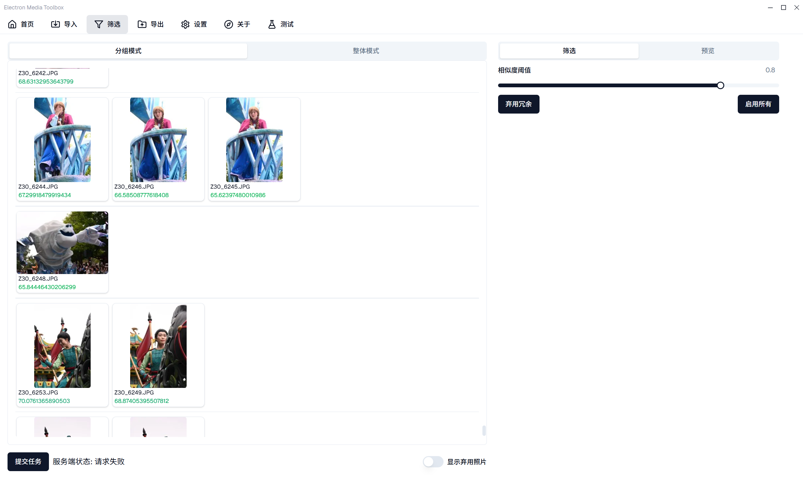

<div align="center">
  
  <h1>SMARK Media Tools</h1>
  <p><b>基于 GPU/ONNX 加速的摄影后期选片与管理工具箱</b></p>

  <p>
    <a href="README_En.md">English</a> | <b>简体中文</b>
  </p>

  <p>
    
    
    
  </p>
</div>

---

## 📖 项目简介

**SMARK Media Tools** 是一款专为摄影爱好者设计的本地化媒体管理工具。针对连拍产生的海量废片与重复照片，本工具提供了一套高效的自动化整理方案：

1.  **智能分组**：通过 HSV 直方图相似度，自动将连拍序列或相似场景聚类，相似度阈值支持滑块调节与精确输入。
2.  **美学评分**：集成 ZJU **LAR-IQA** 无参考图像质量评估算法（ONNX Runtime / DirectML 加速），自动筛选组内最佳照片。
3.  **人脸检测与眨眼分析**：集成 det_10g 人脸检测 + ocec_l 睁眼分类 + 2d106det 面部关键点三个 ONNX 模型，识别照片中的人脸并标注睁眼（绿）/疑似闭眼（黄）/闭眼（红）状态，辅助判断废片。
4.  **保留策略**：按 IQA 画质排序或睁眼优先自动弃用冗余照片，每组保留数量可调。
5.  **一键导出**：快速标记保留/废弃，将精选照片导出至目标文件夹，同时拷贝同名 RAW 文件。

> **性能参考**：缩略图生成约 **3ms/帧**，质量评估推理约 **1s/帧** (取决于 GPU 性能)。预览图采用 ImageBitmap 缓存，已查看照片切换零延迟。

<div align="center">
  
</div>

---

## ✨ 主要特性

- **⚡ 全链路加速**
  - **ONNX Runtime (DirectML)**：将 LAR-IQA 模型导出为 ONNX 格式，基于 DirectML 后端在 Windows 平台上统一支持 NVIDIA / AMD / 集成显卡及 CPU，加速推理的同时脱离笨重的 PyTorch 环境与 CUDA 依赖。（macOS 暂走 CPU 推理）
  - **Nuitka 编译**：Python 后端被编译为单一可执行文件（Windows `web_api.exe` / macOS `web_api.app`），启动速度快，资源占用低。

- **🧠 自动化后端管理**
  - Electron 主进程自动接管后端生命周期（启动/保活/关闭）。
  - 内置健康检查机制：启动前自动探测后端状态，实时监控响应延迟。

- **📦 开箱即用**
  - Windows 提供 `.msi` / `.exe` 安装包，macOS 提供 `.zip` 包，内含 Electron 前端、预编译后端及 ONNX 模型。
  - **无需配置 Python 环境**，无需安装 CUDA 工具包（依赖已内置）。

- **🎨 现代化交互**
  - 基于 Shadcn UI + Tailwind CSS 构建，支持键盘快捷键操作。
  - 直观的"分组-详情"视图，双击切换启用/弃用，方向键导航，滚轮缩放，拖拽平移。
  - 人脸缩略图条可点击聚焦，追踪模式下自动匹配同一个人脸。

---

## 📥 安装与运行

### 1. 终端用户 (推荐)

请直接访问 [Releases](../../releases) 页面下载最新版本的安装包：

- **Windows**：下载 `.msi` 或 `.exe`，双击安装即可，无需任何额外配置。
- **macOS**（实验性）：下载 `.zip`，解压后拖入应用程序文件夹。使用 ImageIO / QuickLook 加速缩略图生成。

> Windows SmartScreen 可能拦截未签名的安装包，点击"仍要运行"即可。

### 2. 开发者 (源码编译)

如需二次开发，请分别准备 Node.js 和 Python 环境。

```bash
# 1. 克隆仓库（需 Git LFS，ONNX 模型约 105MB）
git clone https://github.com/SMARK2022/electron-media-toolbox.git
cd electron-media-toolbox
git lfs install
git lfs pull

# 2. 准备后端 (推荐使用 Conda/venv)
cd python
pip install -r requirements.txt
cd ..

# 3. 安装前端依赖 + 编译 native 模块
npm install
npm run rebuild          # 编译 better-sqlite3 为 Electron ABI

# 4. 编译后端（需要 Conda 环境含 Nuitka）
npm run python:make      # 产物在 python/out/ 下

# 5. 启动应用
npm run start
```

> **注意**：开发模式下，Electron 将自动启动编译好的后端；若后端 exe 不存在则前端仍可启动但功能受限。

### 测试与校验

```bash
npm run test             # 单元测试 (vitest, jsdom, 跨平台)
npm run test:e2e         # E2E 测试 (Playwright + Electron, 需先 npm run package)
npm run lint             # ESLint
npx tsc --noEmit         # TypeScript 类型检查
npm run format           # Prettier 格式检查
```

---

## 🛠️ 技术栈

| 模块             | 技术选型                          | 说明                                                                |
| :--------------- | :-------------------------------- | :------------------------------------------------------------------ |
| **UI / Desktop** | Electron 39, Vite, React 19, TypeScript (strict) | Shadcn UI + Tailwind CSS v4 + Zustand + TanStack Router/Query       |
| **Backend**      | FastAPI, Uvicorn                  | 核心业务逻辑与文件 I/O，Nuitka 编译为独立二进制                      |
| **AI Inference** | **ONNX Runtime (DirectML)**       | LAR-IQA + 人脸检测/睁眼/关键点模型，Windows GPU 加速 / macOS CPU    |
| **Database**     | better-sqlite3 (WAL)              | Electron/Python 跨进程并发读写                                      |
| **Packaging**    | Electron Forge 7                  | Windows: Squirrel `.exe` + WiX `.msi` / macOS: `.zip`               |
| **Testing**      | Vitest + Playwright               | 单元测试 (jsdom) + E2E 测试 (Electron 集成, 53 个用例)              |
| **CI/CD**        | GitHub Actions                    | quality → build → e2e → release 统一流水线                          |

---

## 🗓️ 功能规划

* [x] **照片智能分组** (HSV 直方图)
* [x] **LAR-IQA 美学评分** (ONNX Runtime / DirectML)
* [x] **人脸检测与眨眼分析** (det_10g + ocec_l + 2d106det)
* [x] **保留策略可配置** (IQA 排序 / 睁眼优先 / 自定义保留数量)
* [x] **后端独立编译与生命周期管理** (Nuitka + Auto-start)
* [x] **Windows MSI 安装包封装**
* [x] **macOS 多平台支持** (ImageIO / QuickLook 缩略图, Nuitka `--mode=app`)
* [x] **预览图 ImageBitmap 缓存** (createImageBitmap + canvas, 切换零延迟)
* [ ] 多维度排序指标 (文件大小、拍摄时间等)
* [ ] 视频文件的导入与切片支持

---

## 📝 更新日志

### v2.1.3 (2026-06-25)

* **macOS 多平台支持**：原生缩略图加速（IShellItemImageFactory / ImageIO + QuickLook），Nuitka `--mode=app` 编译为 `.app` bundle。
* **保留策略可配置**：支持 IQA 画质排序 / 睁眼优先两种弃用依据，每组保留数量可调。
* **相似度阈值精确输入**：滑块旁支持直接输入数值。
* **SQLite 并发安全**：WAL 模式 + 原子 clearPhotos 事务 + 检测期间导入守卫，防止数据损坏。
* **EXIF 读取优化**：64KB 部分缓冲区替代全文件读取，显著减少 I/O 开销。
* **预览图加载优化**：ImageBitmap 缓存 + canvas 渲染，已查看照片切换零延迟。
* **E2E 测试体系**：Playwright + Electron，53 个测试用例覆盖导入→筛选→点选→导出完整流程。
* **CI/CD 统一流水线**：quality → build → e2e → release 依赖链。
* **i18n 与可访问性修复**：补全缺失翻译、添加 aria-label、清理死代码。

### v2.1.2 (2026-06-23)

* **人脸检测与眨眼分析**：集成 det_10g（人脸检测）+ ocec_l（睁眼/闭眼分类）+ 2d106det_batch（106 点面部关键点）三个 ONNX 模型，标注睁眼/疑似闭眼/闭眼状态。
* **E2E 测试体系**：Playwright + Electron，覆盖导入→筛选→点选→导出完整流程。
* **CI/CD 基础设施**：GitHub Actions 自动化（test / build / release）、Git LFS 管理 ONNX 模型。
* **ESLint 全量清理**：修复 212 个违规，lint 成为 CI 阻塞门禁。
* **husky 钩子**：添加 pre-commit / pre-push 钩子执行 lint 和测试检查。
* **release notes 自动生成**：从 commit log 按版本 bump 分节展示变更。
* **ImagePreview 交互优化**：缩放/平移/拖动/防抖/动画改进。
* **PhotoGrid 虚拟化**：使用 react-virtual 优化大量照片的渲染性能。
* **FaceTracker 匹配器**：跨照片追踪同一个人脸，切换时自动聚焦。

### v2.1.1 (2025-11-24)

* **推理后端迁移**：从 `onnxruntime-gpu` 切换为 `onnxruntime-directml`，在 Windows 平台上统一支持 NVIDIA / AMD / CPU，无需额外安装 CUDA/cuDNN。
* **兼容性优化**：完善 Nuitka onefile 退出流程与信号处理，避免强制终止导致临时解压目录无法清理。
* **眨眼检测初步实验**：开始探索眨眼识别功能（后续在 v2.1.2 正式集成）。

### v2.1.0 (2025-11-20)

* **架构升级**：后端迁移至 ONNX Runtime，移除 PyTorch 依赖，体积大幅减小。
* **编译优化**：使用 Nuitka 编译后端为独立可执行文件，极大提升启动速度与稳定性。
* **后端生命周期管理**：Electron 主进程自动启动/保活/关闭后端，内置健康探测与延迟显示。
* **PhotoFilterPage 重构**：新增 PhotoDetailsTable 组件，优化筛选页布局。
* **关于页面**：新增反馈链接和 GitHub 个人资料链接。

### v2.0.0 (2025-11-19)

* **正式发布**：推出 `.msi` 安装包，重构导入/导出流程，UI 全面升级。

---

## 📂 项目结构

```text
electron-media-toolbox/
├── python/
│   ├── web_api.py               # FastAPI 后端入口
│   ├── out/                     # Nuitka 编译产物 (web_api.exe / web_api.app)
│   ├── checkpoint/              # ONNX 模型文件 (Git LFS, ~105MB)
│   └── utils/                   # 图像处理算法 (HSV, IQA, 人脸, 缩略图)
├── src/
│   ├── main.ts                  # Electron 主进程 (后端管理, 协议处理)
│   ├── pages/                   # 页面 (Import / Filter / Export)
│   ├── components/              # 组件 (PhotoGrid / ImagePreview / bitmapCache)
│   ├── helpers/
│   │   ├── services/            # PhotoService (导入, 检测, 状态轮询)
│   │   ├── store/               # Zustand 状态管理
│   │   ├── ipc/                 # IPC 通道 (数据库, 窗口, 主题)
│   │   └── cache/               # LRU 缓存
│   └── tests/
│       ├── unit/                # Vitest 单元测试
│       └── e2e/                 # Playwright E2E 测试
├── .github/
│   ├── workflows/ci.yml         # 统一 CI 流水线
│   └── actions/                 # 可复用 Composite Actions
├── scripts/                     # 构建辅助脚本
└── forge.config.ts              # Electron Forge 打包配置
```

---

## 📄 许可证与致谢

本项目基于 **Apache License 2.0** 开源。

* **LAR-IQA**: [https://github.com/nasimjamshidi/LAR-IQA](https://github.com/nasimjamshidi/LAR-IQA)
* **UI Template**: [electron-shadcn](https://github.com/LuanRoger/electron-shadcn)

**作者**: [SMARK](https://github.com/SMARK2022) | 📧 [SMARK2019@outlook.com](mailto:SMARK2019@outlook.com)
